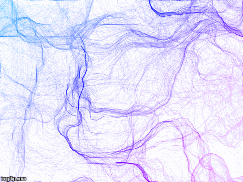
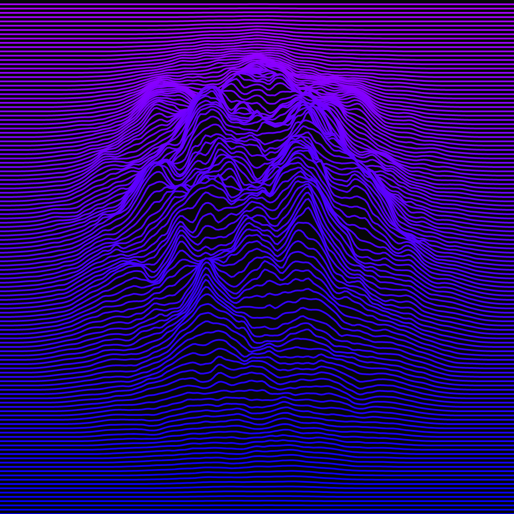
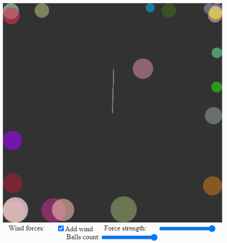
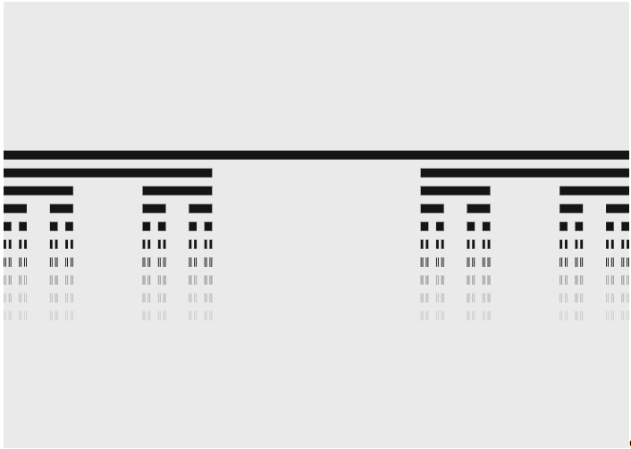

# p5_beauty
 
### perlin_noise dir
contains script with creating beauty curves and shapes 
example

---
### wave lines

code [here](wave_lines/).
realisation [here](https://editor.p5js.org/callofdutz/sketches/RKsuYJEs) . click 'play' to run script

---
### forces
some physics (friction, weight, wind forces) for circles.
code [here].

realisation [here](https://editor.p5js.org/callofdutz/sketches/HG3FAtNZ). click 'play' to run script

---
### fractals
simple CantorSet fractal

